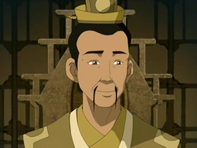

# Lao


Vous possédez l'effet <mark style="color:red;">**Force I**</mark> permanent.



Vous obtenez l'identité de <mark style="color:yellow;">**Poppy**</mark> à l'annonce des rôles.



Vous pouvez également activez l'effet <mark style="color:blue;">**Résistance II**</mark> pendant 2 minute par partie, il se régénère de 10 secondes par assist et 15 par élimination. (Ne peut pas dépasser le temps de 2 minutes dans la banque de temps)&#x20;


Ce pouvoir **ne se cumule pas si il n'est pas utilisé**, de plus **ce pouvoir désactivera votre effet **<mark style="color:red;">**Force I**</mark>** si vous n'êtes pas **<mark style="color:orange;">**Duo**</mark>.




Si <mark style="color:red;">**Zuko**</mark> ne prend pas le <mark style="color:orange;">**pacte Duo**</mark>** vous deviendrez un rôle en **<mark style="color:orange;">**Duo**</mark>** avec **<mark style="color:orange;">**Poppy**</mark> et vous obtiendrez alors l'effet <mark style="color:blue;">**Résistance I**</mark> permanent.

* Vous deviendrez **immunisé à 50% des dégâts des flèche**s.


Votre objectif sera **pour vous et votre **<mark style="color:orange;">**Duo**</mark>** alors de tuer votre fille dont vous recevez le pseudo au moment ou vous saurez que vous devenez un rôle **<mark style="color:orange;">**Duo**</mark> et si vous parvenez vous ou votre <mark style="color:orange;">**Duo**</mark> **à la tuer vous gagnerez l'effet** <mark style="color:yellow;">**Vitesse I**</mark>** permanent ainsi que 2**:heart: **supplémentaires**.



<figure><figcaption></figcaption></figure>
