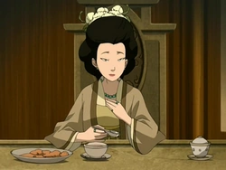

# Poppy


Vous possédez l'effet <mark style="color:red;">**Force I**</mark> permanent.



Vous obtenez l'identité de <mark style="color:yellow;">**Lao**</mark> à l'annonce des rôles.



Vous pouvez également vous téléportez dans le dos du joueur visé toutes les 5 minutes.



Si <mark style="color:red;">**Zuko**</mark> ne prend pas le <mark style="color:orange;">**pacte Duo**</mark>** vous deviendrez un rôle en duo avec **<mark style="color:orange;">**Lao**</mark> et vous obtiendrez alors l'effet <mark style="color:yellow;">**Vitesse I**</mark> permanent et vous **régénérez 1/2**:heart: **toutes les 5 secondes proche de lui**.


Votre objectif sera pour vous et votre <mark style="color:orange;">**Duo**</mark> **de tuer votre fille dont vous recevez le pseudo au moment ou vous saurez que vous devenez un rôle **<mark style="color:orange;">**Duo**</mark> et si vous parvenez vous ou votre <mark style="color:orange;">**Duo**</mark> à la tuer vous **gagnerez l'effet **<mark style="color:blue;">**Résistance I**</mark>** permanent ainsi que 2**:heart: **supplémentaires**.



<figure><figcaption></figcaption></figure>
