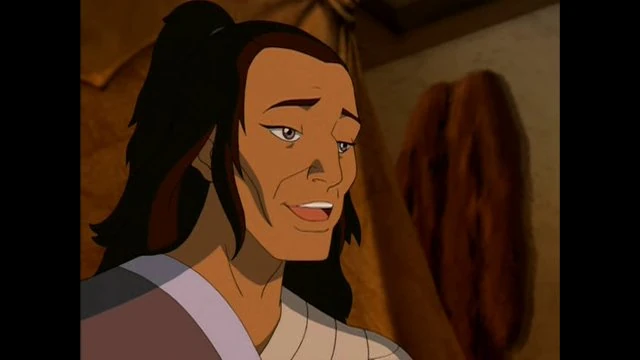

# Bato


Vous possédez soit l'effet <mark style="color:red;">**Force I**</mark> soit l'effet <mark style="color:blue;">**Résistance I**</mark> sous la :droplet:.



En cas de mort de <mark style="color:blue;">**Sokka**</mark> ou <mark style="color:blue;">**Katara**</mark> vous obtiendrez l'identité de <mark style="color:blue;">**Hakoda**</mark>.



Vous obtenez une <mark style="color:blue;">**Rod**</mark> **invisible pour les autres joueurs, et pour chaque poisson jusqu'à 10 vous gagnerez 2% d'un effet aléatoire**.



En cas de présence de plus de 4 membres des <mark style="color:blue;">**Tribus de l'Eau**</mark> autour de vous ( 35 blocs ) vous aurez alors un "?" qui apparaîtra au dessus de votre hotbar.


<mark style="color:orange;">**Hama**</mark> et la <mark style="color:red;">**Sorcière des**</mark>** **<mark style="color:blue;">**Marais**</mark> compte pour ce pouvoir.



<figure><figcaption></figcaption></figure>
