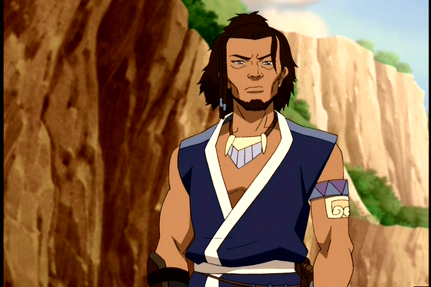

# Hakoda


Vous possédez l'effet <mark style="color:red;">**Force I**</mark> sous les rayons de la :last\_quarter\_moon\_with\_face: ainsi que sous la:droplet:.



Vous recevez à l'annonce des rôles une épée en diamant <mark style="color:blue;">**Tranchant III**</mark>** qui possède 5% de chance d'infliger **<mark style="color:blue;">**Lenteur I**</mark>** pendant 8 secondes au joueur touché**.


Ce % augmente de 5% à la mort de <mark style="color:blue;">**Kanna**</mark>, <mark style="color:blue;">**Sokka**</mark> et <mark style="color:blue;">**Katara**</mark>.




Vous êtes au courant **toutes les 5 minutes si vous avez croisé l'un des trois rôles faisant partie de votre famille à moins de 5 blocs**.


<figure><figcaption></figcaption></figure>
