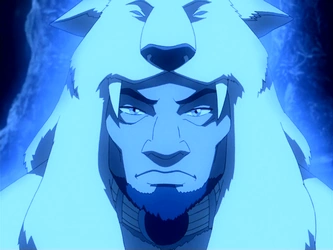

# Kuruk


Vous possédez l'effet <mark style="color:yellow;">Speed I</mark> permanent ainsi que <mark style="color:blue;">Résistance I</mark> sous la <mark style="color:blue;">**pluie Torrentielle**</mark>.


Vous obtenez un livre <mark style="color:blue;">Depth Strider II</mark>.

Vous possédez deux pouvoirs élémentaires.

|                                                                  |                                                                                                                                                                                                                                                                                              |
| ---------------------------------------------------------------- | -------------------------------------------------------------------------------------------------------------------------------------------------------------------------------------------------------------------------------------------------------------------------------------------- |
| Pouvoir élémentaire : <mark style="color:blue;">Blizzard</mark>  | Vous déclenchez une pluie de particules blanches en forme de flocons ( neiges ) qui infligent 0,5 cœur de dégâts lors qu'elle touche un joueur ne maitrisant pas l'eau ( avatar compris ), ils seront ensuite stun pendant 0,5 secondes. Le blizzard dure 12 secondes ( cooldown 5 minutes ) |
| Pouvoir élémentaire: <mark style="color:blue;">Submersion</mark> | Vous faites apparaître une couche d'eau de 3 d'épaisseur dans un rayon de 50 block tout autour de vous, cette zone s'évapore au bout de 1 minute. ( Cooldown: 10 minutes  )                                                                                                                  |

Vous possédez la commande <mark style="color:blue;">**/av frost**</mark> permettant de transformer en block de glace n'importe quelle source d'eau et de lave, durant cette période vous devenez immunisé aux dégâts du feu.\
Passif activable 1 minute 30 par épisode et devenant permanent si vous devenez l'<mark style="color:blue;">**Avatar**</mark>.

Vous êtes soumis à la condition de l'<mark style="color:blue;">**Avatar**</mark><mark style="color:blue;">.</mark>

<figure><figcaption></figcaption></figure>
