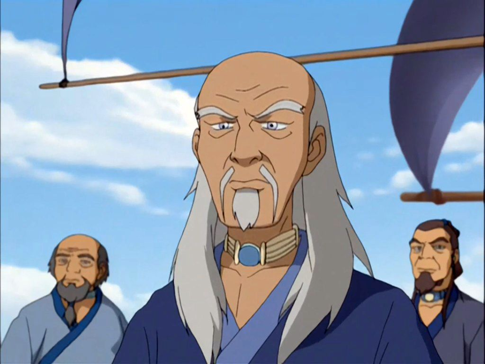

# Paku


Vous possédez l'effet <mark style="color:blue;">**Résistance I**</mark> sous la :droplet:.


Vous êtes considéré comme l'un des plus grands <mark style="color:blue;">**maîtres élémentaires de l'eau**</mark>:ocean: du monde, vous possédez donc de **puissants pouvoirs**.

<table><thead><tr><th width="297"></th><th></th></tr></thead><tbody><tr><td>
<strong>Pouvoir élémentaire</strong>: 

<mark style="color:blue;"><strong>Givre</strong></mark>❄
</td><td><strong>Les joueurs non affiliés à la </strong><mark style="color:blue;"><strong>tribu élémentaire de l'eau</strong></mark>🌊 <strong>reçoivent le statut </strong><mark style="color:blue;"><strong>Gel</strong></mark>❄ ce qui fait qu'ils subiront un <strong>stun de 1 secondes toutes les 10 secondes pendant 2 minutes</strong>. <strong>Seul les joueurs à moins de 25 blocs de vous peuvent être </strong><mark style="color:blue;"><strong>gelé</strong></mark>. ( Cooldown: 7 minutes )</td></tr><tr><td>
<strong>Pouvoir élémentaire</strong>: 

<mark style="color:blue;"><strong>Tentacule d'eau</strong></mark>🌊
</td><td>Vous pouvez utiliser votre pouvoir (avec un click droit avec votre épée en sneak) <strong>ce qui déclenchera un trait de particules d'</strong><mark style="color:blue;"><strong>eau</strong></mark><strong> vers le joueur</strong>, si il est touché <strong>il sera ralenti et lui obtiendra l'effet </strong><mark style="color:blue;"><strong>Lenteur I</strong></mark><strong> pendant que vous écoperez de </strong><mark style="color:yellow;"><strong>Vitesse I</strong></mark> ( 12 secondes ) de plus à la fin du <strong>pouvoir vous serez automatiquement téléportez dans son dos</strong>. ( Cooldown: 5 minutes )</td></tr></tbody></table>

<figure><figcaption></figcaption></figure>
