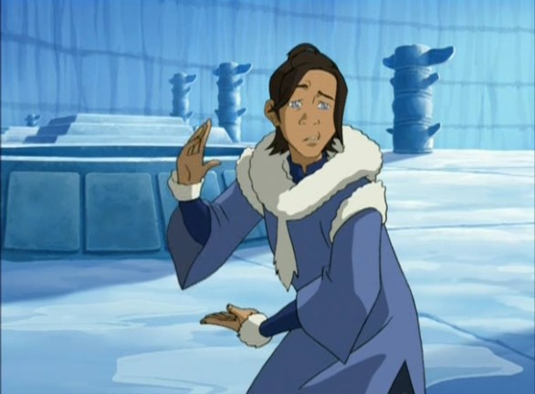

# Sangok


Vous ne possédez aucun effet.



Vous obtenez à l'annonce des rôles des bottes en diamant <mark style="color:blue;">Protection IV</mark> que vous seul pourrez portez.&#x20;


Vous êtes un <mark style="color:blue;">**maître élémentaire de l'eau**</mark> possédant des **pouvoirs élémentaires**.

|                                                                                                                                                                                          |                                                                                                                                                                                                                                                                                                            |
| ---------------------------------------------------------------------------------------------------------------------------------------------------------------------------------------- | ---------------------------------------------------------------------------------------------------------------------------------------------------------------------------------------------------------------------------------------------------------------------------------------------------------- |
| 
<strong>Pouvoir élémentaire</strong>: <mark style="color:blue;"><strong>Lances de glaces</strong></mark>❄
 | 
Ce pouvoir inflige 2❤ de dégâts au joueur touché ainsi que l'effet <mark style="color:blue;"><strong>Lenteur I</strong></mark><strong> pendant 10 secondes</strong>. ( Cooldown 6 minutes )
                                 |
| 
<strong>Pouvoir Elémentaire</strong>: <mark style="color:blue;"><strong>Dissipation</strong></mark>🌊
    | 
Ce pouvoir vous rend <strong>invulnérable pour les 8 prochains coup reçu</strong> ( utilisable uniquement en étant à 3❤ ou moins ) <strong>vous ne pourrez pas taper pendant cette période</strong>. ( Cooldown 8 minutes )
 |

<figure><figcaption></figcaption></figure>
